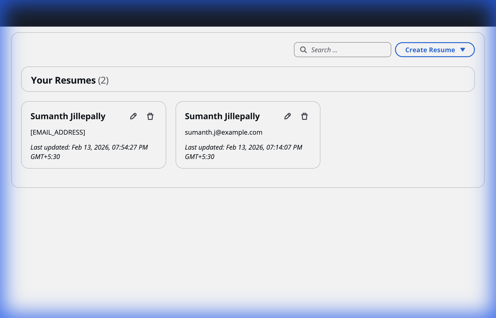
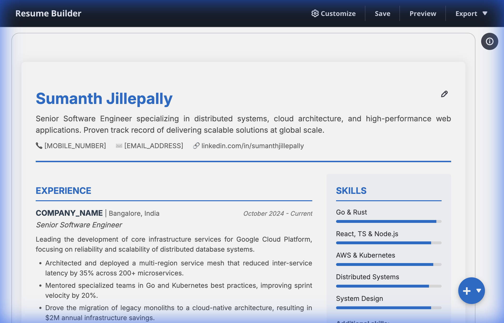
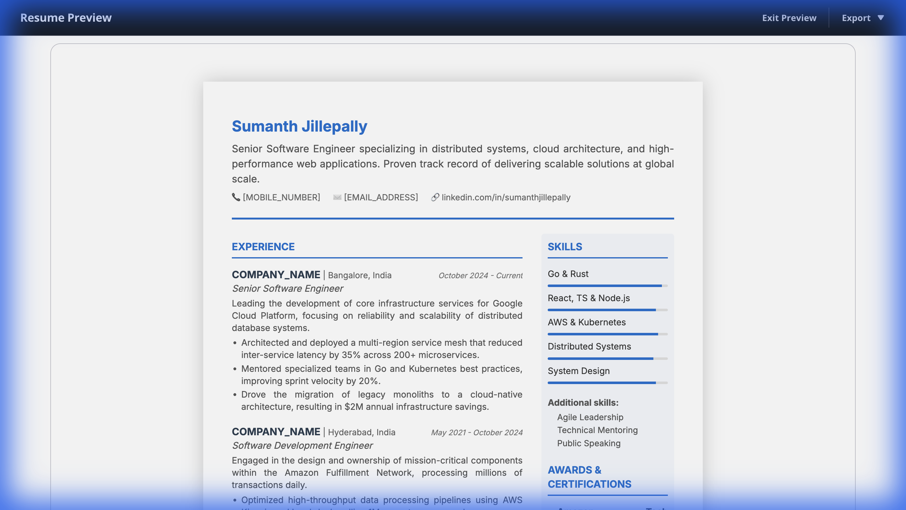
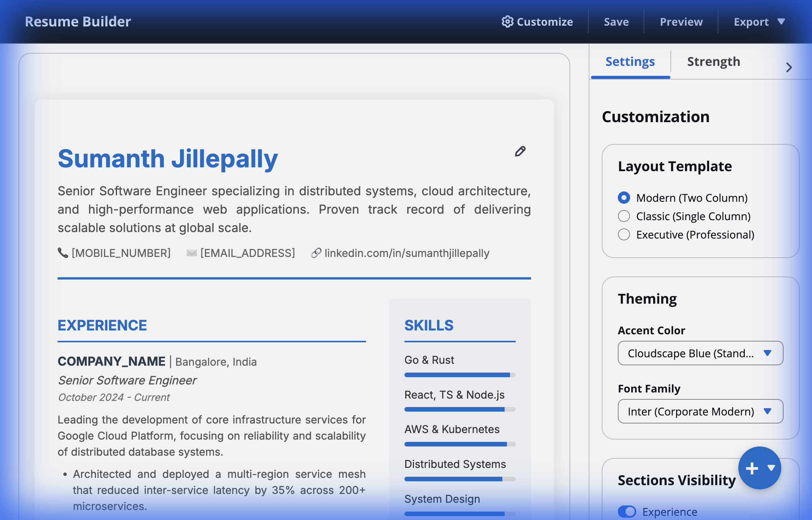
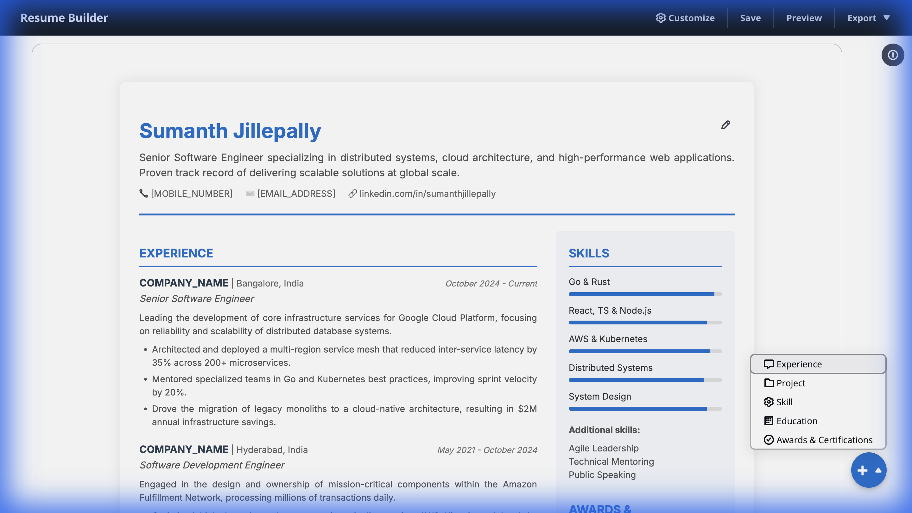
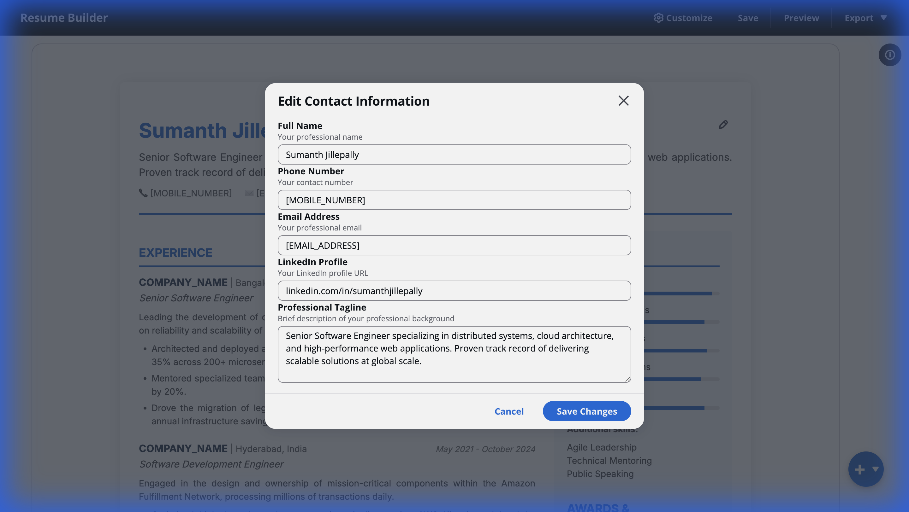

# 📄 Professional Resume Builder

A high-performance, **AI-augmented** React application designed for crafting pixel-perfect, ATS-optimized resumes. Built with a focus on privacy, precision, and modern design aesthetics.

## 📸 Experience the Interface

### **1. Professional Dashboard**
Manage multiple resumes with a clean, organized overview.


### **2. Interactive WYSIWYG Editor**
Edit every section of your resume with modal-based precision and real-time updates.


### **3. Live PDF Preview**
What you see is exactly what you get. Accurate page-break indicators and professional formatting.


### **4. Deep Customization**
Tailor your resume with dynamic themes, professional fonts, and industry-standard templates.


### **5. Dynamic Section Management**
Add new sections (Experience, Projects, etc.) on the fly with the floating action menu.


### **6. Precision Editing**
Refine every detail with focused, modal-based editors for every field.


---

## ✨ Cutting-Edge Features

### 🤖 **AI Content Polish**
Stop struggling with bullet points. Our integrated AI assistant helps you polish your job responsibilities and project descriptions into high-impact, professional statements.

### 🎨 **Dynamic Theming & Templates**
Choose from three distinct, industry-standard templates:
*   **Modern**: Clean layout with a sophisticated sidebar.
*   **Executive**: Centered, high-authority branding.
*   **Classic**: Traditional, time-tested professional structure.
*   *Customize with any accent color and professional typography (Inter, Roboto, Serif).*

### 📊 **Resume Strength Analysis**
Get real-time feedback on your resume's completeness. Our intelligent scoring system guides you through adding missing contact info, skills, and experience to ensure your profile is market-ready.

### 🖨️ **Advanced PDF Export Engine**
We've built a custom print-isolation engine that leverages native browser rendering for **pixel-perfect PDF exports**. 
*   **Zero Blur**: Text remains as high-quality vectors.
*   **ATS Optimized**: Guaranteed searchability and parsing compatibility.
*   **A4 Precision**: Exact margin and padding control for professional outcomes.

### 🛡️ **Privacy & Persistence**
Your data belongs to you. No cloud account required.
*   **Local-First Architecture**: Powered by **IndexedDB** for blazing-fast local persistence.
*   **JSON Export/Import**: Easily backup your resume data or move it between machines.

---

## 🛠️ Technical Stack

- **Framework**: [React 18](https://reactjs.org/) + [TypeScript](https://www.typescriptlang.org/)
- **Design System**: [Cloudscape Design System](https://cloudscape.design/) (AWS-inspired)
- **State Management**: [Redux Toolkit](https://redux-toolkit.js.org/)
- **Database**: [Dexie.js](https://dexie.org/) (IndexedDB wrapper)
- **Styling**: Vanilla CSS with CSS Variables for theme engine
- **PDF Generation**: Native Browser Print Integration with Print-Only DOM Isolation

---

## 🚀 Getting Started

### Prerequisites
*   [Node.js](https://nodejs.org/) (v16+)
*   [Yarn](https://yarnpkg.com/) or npm

### Installation & Run

1. **Clone the repository**
   ```bash
   git clone https://github.com/Sumanth1908/Resume.git
   cd Resume
   ```

2. **Install Dependencies**
   ```bash
   yarn install
   ```

3. **Launch the Application**
   ```bash
   yarn start
   ```
   The app will automatically open at `http://localhost:3000`.

---

## 🏗️ Architecture

```
src/
├── components/          # React components
│   ├── editors/        # Specialized section editors (Exp, Edu, etc.)
│   ├── layout/         # Core AppLayout and Navigation
│   ├── ResumeBuilder.tsx # Main orchestration component
│   └── ResumeDisplay.tsx # The WYSIWYG rendering engine
├── store/              # Redux logic (resumeSlice, settingsSlice)
├── services/           # Business logic (database.ts, pdfExport.ts)
├── config/             # Theme & Template definitions
└── utils/              # Helper functions (Date formatting, AI prompts)
```

---

## 💡 How to Use

1.  **Template First**: Start by clicking **"Use Template"** to see a professionally crafted example.
2.  **Refine Details**: Use the contextual **Edit** buttons (visible on hover) to modify sections.
3.  **Optimize with AI**: In any description field, look for the **Polish** button to enhance your writing.
4.  **Customize**: Open the **Settings** panel to change your theme color, fonts, and template style.
5.  **Check Strength**: Watch the **Resume Strength** bar to see what's missing.
6.  **Export**: Switch to **Preview Mode** to check page breaks, then hit **Download PDF**.

---

**Built for developers, by developers. Built with ❤️.**
